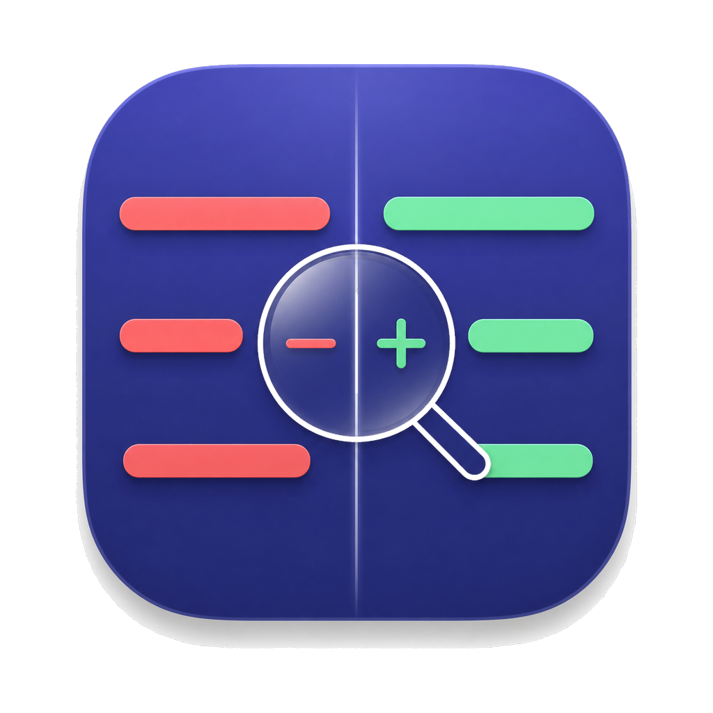

<p align="center">
  
</p>

<h1 align="center">GitScope</h1>

<p align="center">A native macOS diff client — compare any two branches of a local Git repository<br/>with a fast, fully native (no WebView) rendering pipeline. Built with Swift 6 + AppKit.</p>

<p align="center">
  <a href="https://github.com/canglan-cmyk/GitScope/releases/latest"></a>
  
  
</p>

## Features

- **Branch comparison**: three-dot (`A...B`, merge-base, GitHub-compatible) and two-dot (`A..B`) diff semantics
- **Native diff rendering**: CoreText drawing inside a virtualized `NSTableView` — smooth with diffs of tens of thousands of lines
- **Unified & Split view**: stacked or side-by-side with line pairing, placeholders and intra-line character highlights
- **File tree sidebar**: changed files grouped by directory, click to jump, per-file +/− stats
- **Text selection & copy**: drag selection, ⌘C (plain code, no line numbers/markers), ⌘A, double-click word selection
- **Themes**: GitHub, Classic, Solarized, Colorblind-safe — each with light/dark palettes following system appearance

## Architecture

| Module | Responsibility |
| --- | --- |
| `DiffCore` | Pure-Swift domain model, unified diff parser, intra-line highlighter, split-row pairing |
| `DiffRenderKit` | CoreText-based rendering, virtualized diff list, themes, selection |
| `GitEngine` | `GitEngine` protocol + git CLI implementation (three-dot/two-dot diff) |
| `GitScope` | AppKit app shell: split view, sidebar, toolbar |

## Requirements

- macOS 14+
- Xcode 26+, Swift 6
- [Tuist](https://tuist.dev)

## Getting started

```bash
tuist generate        # generates GitScope.xcworkspace
open GitScope.xcworkspace
```

Run the `GitScope` scheme, then click "打开仓库…" and pick any local Git repository.

## Tests

```bash
xcodebuild test -workspace GitScope.xcworkspace -scheme DiffCore -destination 'platform=macOS'
xcodebuild test -workspace GitScope.xcworkspace -scheme DiffRenderKit -destination 'platform=macOS'
xcodebuild test -workspace GitScope.xcworkspace -scheme GitEngine -destination 'platform=macOS'
```

## Roadmap

- Syntax highlighting
- GitHub PR integration (fetch `refs/pull/{n}/head`, local three-dot diff)
- Expandable context around hunks
- Localization (zh-Hans / zh-Hant / en / ja / ko)
